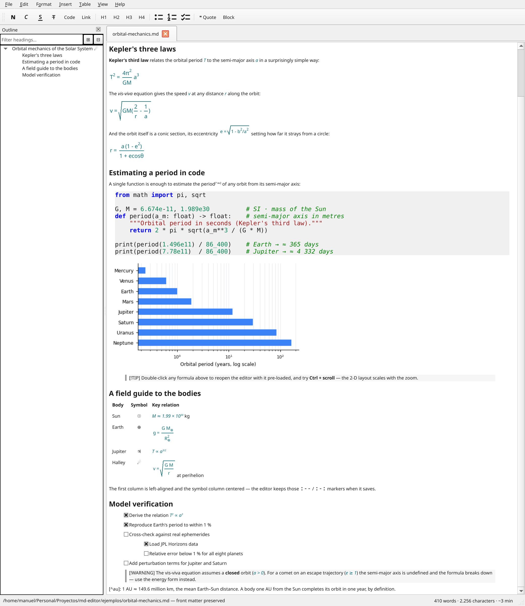

# md-editor

A Markdown editor where you write on the rendered text and save clean Markdown.
TeX formulas, aligned tables, highlighted code, document templates, and export to
PDF/DOCX/ODT/LaTeX — lightweight, portable (Qt6/C++17, zero external
dependencies), in 9 languages.




---

## Downloads

| System | File | Notes |
|--------|------|-------|
| **Linux** (x86_64) | [`md-editor-2.8.4-x86_64.AppImage`](https://github.com/ManuelAriasCalleja/Markdown-editor/releases/latest) | Single-file executable. `chmod +x` and double-click. |
| **Windows** (x64) | [`md-editor-2.8.4-windows-x64.zip`](https://github.com/ManuelAriasCalleja/Markdown-editor/releases/latest) | Portable: unzip and run `md-editor.exe`. |
| **macOS** (Apple Silicon + Intel) | [`md-editor-2.8.4-macos-universal.dmg`](https://github.com/ManuelAriasCalleja/Markdown-editor/releases/latest) | First launch: Ctrl-click → *Open* (binary not signed). |

> All downloads, including previous versions, on the
> [releases page](https://github.com/ManuelAriasCalleja/Markdown-editor/releases).

---

## Installing on Linux

The AppImage is a single self-contained executable — no installation, no root:

1. `chmod +x md-editor-*-x86_64.AppImage`
2. Run it (double-click, or `./md-editor-*-x86_64.AppImage document.md`).

**If it does not start:**

- *`dlopen(): error loading libfuse.so.2`* — AppImages mount themselves with
  FUSE 2, which recent distributions no longer install by default. Either install
  it (`sudo apt install libfuse2` on Debian/Ubuntu, `sudo dnf install fuse-libs`
  on Fedora) or skip the mount altogether:
  `./md-editor-*-x86_64.AppImage --appimage-extract-and-run`.
- *`Could not load the Qt platform plugin "xcb"`* — a minimal or container-based
  system is missing the X libraries Qt needs:
  `sudo apt install libxcb-cursor0 libxkbcommon-x11-0 libfontconfig1`. Adding
  `QT_DEBUG_PLUGINS=1` to the command prints which library is missing.
- *Nothing happens on double-click* — the execute bit (step 1) is missing. Some
  file managers stay silent about it; run it from a terminal to see the error.
- The AppImage does not add itself to the applications menu. If you want an
  entry, either use [AppImageLauncher](https://github.com/TheAssassin/AppImageLauncher)
  or install from source (`sudo ./install.sh`), which does register it.

---

## Installing on Windows

The Windows build is portable: **unzip and run `md-editor.exe`** — no installer.
The binary is not signed yet, so SmartScreen may show a blue *"Windows protected
your PC"* screen on first run. To proceed, click **More info → Run anyway**. This
only happens until the build earns SmartScreen reputation (or gets code-signed).

**If it does not start:**

- *`VCRUNTIME140.dll was not found`* (or `MSVCP140.dll`) — the app is built with
  Microsoft's compiler and needs its runtime, which most machines already have.
  Install the [Visual C++ Redistributable (x64)](https://aka.ms/vs/17/release/vc_redist.x64.exe).
- *The app starts and closes immediately, or complains about a missing DLL* —
  make sure you **extracted the whole ZIP**, not just `md-editor.exe`. The Qt
  DLLs and the `platforms\` folder next to it are part of the program.
- *Windows keeps warning about every file* — right-click the downloaded **ZIP** →
  *Properties* → **Unblock**, and extract it again. Windows marks files that come
  from the internet, and the mark survives extraction.

---

## Installing on macOS

The macOS build is **not signed or notarized** (Apple code signing requires a
paid Developer account). Gatekeeper will therefore block it on first launch with
a *"cannot be opened because it is from an unidentified developer"* message. This
is expected and the app is safe — to open it the first time:

1. Open the `.dmg` and drag **md-editor** into *Applications*.
2. In *Applications*, **Ctrl-click** (or right-click) the app and choose **Open**.
3. Confirm **Open** in the dialog that appears.

You only need to do this once; afterwards it launches normally with a
double-click. Alternatively, after the blocked attempt, go to *System Settings →
Privacy & Security* and click **Open anyway**.

**If it does not start:**

- *"md-editor is damaged and can't be opened. You should move it to the Trash"* —
  the download is not corrupt: this is the quarantine flag macOS puts on unsigned
  downloads. Remove it and open normally:
  `xattr -dr com.apple.quarantine /Applications/md-editor.app`.
- *Ctrl-click → Open does not offer an "Open" button* — on macOS 15 (Sequoia) and
  later that shortcut is gone for unsigned apps. Launch it once (it will be
  blocked), then go to *System Settings → Privacy & Security*, scroll down and
  click **Open Anyway**.

---

## What it does

- **True WYSIWYG**: you never see the Markdown syntax, you see the rendered
  output.
- **Multiple documents in tabs**: open several files at once, each in its own
  tab; the open tabs reopen on the next launch.
- **Clean round-trip**: what you open is what you save. Aligned tables, quotes,
  nested lists, task lists, footnotes, code blocks with syntax highlighting,
  `==highlight==` and `^super^` / `~sub~` script.
- **Type Markdown and it formats itself**: `# `, `> `, `- `, `1. ` at the start of
  a line become the heading, quote or list in place, marker included.
- **TeX formulas** `$…$` and `$$…$$` with real super- and subscripts and a
  live preview — no external dependencies. Double-click to edit.
- **Diagrams**: `mermaid` and `plantuml` code blocks are previewed as an image
  below the block (needs the external `mmdc` / `plantuml` tool; degrades
  gracefully with an install hint if it is missing).
- **Admonitions / callouts** (`> [!NOTE]`, `[!TIP]`, `[!IMPORTANT]`, `[!WARNING]`,
  `[!CAUTION]`) shown as coloured boxes, round-trip compatible with GitHub.
- **Tables without the syntax**: a floating bar appears over the table to add or
  remove rows and columns and set the column alignment; `Tab` walks the cells and
  adds a row at the end; rows can be sorted by a column.
- **Code blocks**: hovering shows the language (click to change it) and a button
  that copies the block.
- **Spell checking** (Hunspell): misspellings underlined in the document's
  language, with suggestions and a personal dictionary.
- **Document templates** (*File → New from template*) and **reusable snippets**
  (*Insert → Snippet*) for content you write often.
- **Export** to PDF, HTML, ODF (`.odt`), LaTeX (`.tex`), DOCX (`.docx`), EPUB
  (`.epub`) and plain text (`.txt`), preserving the document language and the
  formula formatting; the PDF embeds the title and author from the front matter.
- **Import from HTML, EPUB and more** (*File → Import*): converts a web page or an
  EPUB book to Markdown natively, and DOCX/ODT/RTF/LaTeX/reStructuredText… via Pandoc
  (if installed); opens the result as a new untitled document.
- **YAML / TOML front matter** preserved verbatim on save.
- **Navigable outline panel** (F9), find and replace (Ctrl+F / Ctrl+H),
  autosave and crash recovery.
- **Distraction-free mode** (F11) and **focus mode** (typewriter scrolling +
  dimming), full-interface zoom (Ctrl+wheel), 8 light and dark themes (including
  GitHub, Monokai, Solarized and a true high-contrast one) plus an automatic warm
  night light, Markdown source view and side-by-side split view.
- **9 languages**: Spanish, English, German, French, Italian, Portuguese,
  Polish, Dutch and Romanian.
- **Paste images** from the clipboard straight to disk as ``, instead of
  embedding them — so the Markdown stays portable.
- **External file watching**: if the file changes on disk, the app detects it
  and offers to reload.
- **Accessibility**: accessible names on the editor, panels and controls; status
  messages announced to screen readers; full keyboard operation; a true
  high-contrast theme and whole-interface zoom for low vision.

## Common shortcuts

| Shortcut | Action |
|----------|--------|
| `Ctrl+N` / `Ctrl+O` / `Ctrl+S` | New / Open / Save |
| `Ctrl+Shift+S` / `Ctrl+P` | Save as… / Print |
| `Ctrl+W` / `Ctrl+Shift+R` | Close tab / reopen the last closed one |
| `Ctrl+B` / `Ctrl+I` / `Ctrl+U` | Bold / Italic / Underline |
| `Ctrl+E` / `Ctrl+K` | Inline code / link |
| `Ctrl+1`…`Ctrl+6` | Heading levels 1 to 6 |
| `Ctrl+Shift+U` / `Ctrl+Shift+O` / `Ctrl+Shift+T` | Bullet / numbered / task list |
| `Ctrl+Shift+F` | Insert formula |
| `Ctrl+F` / `Ctrl+H` / `F3` | Find / replace / find next |
| `Ctrl+G` / `Ctrl+L` | Go to heading / line |
| `Ctrl++` / `Ctrl+-` / `Ctrl+0` | Zoom in / out / reset |
| `Ctrl+Shift+M` / `Ctrl+Shift+D` | Markdown source view / split view |
| `Ctrl+Shift+P` | Command palette (find & run any action) |
| `Ctrl+,` | Preferences |
| `F11` / `F12` | Distraction-free mode / focus mode |
| `F9` / `F1` | Outline / Help |

Full list under *Help → Manual* inside the app.

---

## Building from source

> **Legal note**: the code is **free software** under **GPL-3.0**. You may
> clone, build, modify and redistribute it, as long as derivatives stay under
> the GPL-3.0. See [License](#license).

### Dependencies

- CMake ≥ 3.16
- Qt 6.5 or higher (modules `Widgets`, `PrintSupport`, `LinguistTools`, `Test`)
  **plus its private headers**: the ODF export uses Qt's private QZip. On
  Debian/Ubuntu these ship in a separate package from `qt6-base-dev`, and
  without them CMake fails at configure time with *"Imported target
  `Qt6::GuiPrivate` includes non-existent path"*.
- A C++17 compiler (GCC 9+, Clang 10+, MSVC 19.20+)
- **Optional**: Hunspell, for spell checking. Without it everything else builds
  and the spell checker is simply inactive. On Linux the dictionaries are the
  system ones (`hunspell-en-us`, `hunspell-es`…).

```bash
# Debian / Ubuntu
sudo apt-get install cmake g++ qt6-base-dev qt6-base-private-dev libhunspell-dev
```

### Linux / macOS

```bash
cmake -S . -B build
cmake --build build
./build/md-editor [file.md]
```

Shortcut: `./build.sh -x example.md` configures, builds and runs.

### Windows (PowerShell)

```powershell
cmake -S . -B build -G "Visual Studio 17 2022"
cmake --build build --config Release
build\Release\md-editor.exe
```

### Tests

```bash
ctest --test-dir build --output-on-failure
```

Tests use **Qt Test**. CMake picks the platform plugin per system: headless
(`offscreen`) on Linux and macOS, native on Windows — where `offscreen` has no
font database, which breaks Markdown serialisation and silences the test output.

### Installation (Linux, optional)

```bash
sudo ./install.sh                     # → /usr/local
PREFIX="$HOME/.local" ./install.sh    # → ~/.local (no sudo)
```

Installs the binary, the `.desktop` launcher and hicolor icons (PNG + SVG).

---

## License

This software is **free software**, distributed under the **GNU General Public
License v3.0** ([**GPL-3.0**](https://www.gnu.org/licenses/gpl-3.0.html)).

Copyright © 2026 Manuel Arias Calleja.

In short:

- ✅ You **may** use, study, and run the program for any purpose.
- ✅ You **may** redistribute copies, source or binary.
- ✅ You **may** modify it and distribute your modified versions — **provided**
  they are also released under the GPL-3.0 (same freedoms for everyone).
- ❌ You **may not** distribute a closed-source or proprietary derivative.

This is a strong copyleft licence: any fork must stay free and open under the
same terms. Full text in [`LICENSE`](LICENSE).

### Contributions

This project **does not accept pull requests**. Development is by the author
only. If you find a bug or have a suggestion, open an *issue* and the author
will consider it. (The licence lets you fork and modify your own copy; that is
independent of this repository's contribution policy.)

---

## Author

**Manuel Arias Calleja** — <manuelariascalleja@gmail.com>

If you find it useful, please ⭐ the repository — that is the simplest way to
let me know it is helping someone.
