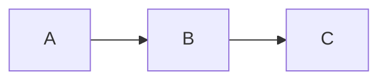

# Markdown auf einer Seite

**Markdown** ist eine Möglichkeit, formatierten Text mit einfachen Symbolen zu
schreiben. Was links steht, ist das, was Sie tippen; rechts, wie es aussieht.
In md-editor müssen Sie diese Symbole nicht tippen: Sie wenden sie über die
Werkzeugleiste an, und beim Speichern erzeugt sie der Editor für Sie.

## Inhalt

- [Absätze und Zeilenumbrüche](#absatze-und-zeilenumbruche)
- [Überschriften](#uberschriften)
- [Hervorhebung](#hervorhebung)
- [Listen](#listen)
- [Zitate](#zitate)
- [Code](#code)
- [Links und Bilder](#links-und-bilder)
- [Fußnoten](#fußnoten)
- [Horizontale Linien](#horizontale-linien)
- [Tabellen](#tabellen)
- [Mathematische Formeln](#mathematische-formeln)
- [Erweiterungen, die md-editor unterstützt](#erweiterungen-die-md-editor-unterstutzt)
- [Front Matter](#front-matter)
- [Escapes](#escapes)

## Absätze und Zeilenumbrüche

Trennen Sie Absätze mit einer **Leerzeile**. Innerhalb eines Absatzes erzwingen
zwei Leerzeichen am Ende einer Zeile einen Umbruch, ohne einen neuen Absatz zu
beginnen.

## Überschriften

```
# Überschrift Ebene 1
## Überschrift Ebene 2
### Überschrift Ebene 3
```

Bis zu sechs Ebenen (`######`). In md-editor können Sie sie auch über
**Format → Überschrift** oder mit Ctrl+1 … Ctrl+6 anwenden.

## Hervorhebung

- `*kursiv*` oder `_kursiv_` → *kursiv*
- `**fett**` oder `__fett__` → **fett**
- `***fett und kursiv***` → ***fett und kursiv***
- `~~durchgestrichen~~` → ~~durchgestrichen~~

## Listen

**Aufzählungen** (mit `-`, `*` oder `+`):

```
- Apfel
- Birne
  - Conference
  - Ercolini
```

**Nummeriert**:

```
1. Erstens
2. Zweitens
3. Drittens
```

**Aufgaben** (Kontrollkästchen):

```
- [x] Erledigt
- [ ] Offen
```

## Zitate

Eine oder mehrere Zeilen, die mit `>` beginnen:

```
> Wer viel liest und viel wandert, sieht viel und weiß viel.
> — Miguel de Cervantes
```

## Code

**Inline**: mit einem Backtick umschließen: `` `Code` ``.

**Block**: drei Backticks am Anfang und am Ende; optional der Name der Sprache,
um ihn einzufärben:

````
```python
def begruessen(name):
    print(f"Hallo, {name}")
```
````

## Links und Bilder

- **Link**: `[Text](https://beispiel.com)`
- **Link mit Titel**: `[Text](https://beispiel.com "Tooltip-Titel")`
- **Bild**: `` — wie ein Link, aber mit einem
  `!` davor.

In md-editor öffnet **Ctrl+Klick** auf einen Link diesen im Systembrowser.

## Fußnoten

Eine **Referenz** im Text und ihre **Definition** an anderer Stelle, verbunden
durch einen Bezeichner `[^id]`:

```
Eine Aussage mit ihrer Nuance[^1].

[^1]: Der Text der Fußnote steht hier.
```

Die `id` kann eine Zahl (`[^1]`) oder ein Wort (`[^nota]`) sein. In md-editor
erstellt **Einfügen → Fußnote** (Ctrl+Shift+N) die Referenz und ihre Definition
für Sie; die Referenzen werden als Hochstellung angezeigt, und ein Klick springt
zur Definition.

## Horizontale Linien

Drei oder mehr Bindestriche, Sternchen oder Unterstriche in einer eigenen
Zeile:

```
---
```

## Tabellen

```
| Produkt | Menge    | Preis  |
|---------|---------:|:------:|
| Brot    |        2 |  1,20 €|
| Milch   |        1 |  0,95 €|
```

Die Doppelpunkte in der Trennzeile legen die Spaltenausrichtung fest: `:--`
links, `:-:` zentriert, `--:` rechts. md-editor behält die Ausrichtung beim
Speichern bei.

## Mathematische Formeln

Standard-Markdown definiert **keine** Formeln, aber eine weit verbreitete
Konvention (Pandoc, Obsidian, Quarto, GitHub) unterstützt TeX-Syntax zwischen
`$...$` (inline) und `$$...$$` (Block). md-editor setzt diese Konvention um.

```
Die Formel $E = mc^2$ ist berühmt.

$$
\sum_{i=1}^n a_i = \frac{n(n+1)}{2}
$$
```

Spezielle TeX-Zeichen (`\`, `_`, `*`, `{`, `}`) bleiben innerhalb von Formeln
intakt — der Editor schützt sie, damit der Markdown-Parser sie nicht mit Kursiv
oder Fett verwechselt.

In md-editor erscheinen Formeln gerendert mit echten Hoch- und Tiefstellungen
(nicht als wörtliches `$x^2$`). Fügen Sie eine mit **Einfügen → Formel…**
(Ctrl+Shift+F) ein oder doppelklicken Sie auf eine vorhandene, um sie zu
bearbeiten.

## Erweiterungen, die md-editor unterstützt

Über das Obige hinaus — das ist Standard-Markdown — versteht md-editor vier weit
verbreitete Konventionen. Sie gehören nicht zum ursprünglichen Markdown, daher
kann ein anderer Editor sie als wörtlichen Text anzeigen; die Datei wird in
jedem Fall unverändert gespeichert, es geht also nichts verloren.

**Hervorhebung** (Stil GitHub/Obsidian): zwei Gleichheitszeichen auf jeder Seite.

```
Das ist ==hervorgehoben== wie mit einem Textmarker.
```

**Hoch- und Tiefstellung** (Pandoc-Stil): Zirkumflex und Tilde.

```
Die Fläche beträgt 12 m^2^ und die Formel von Wasser ist H~2~O.
```

**Hinweise** oder *Callouts* (GitHub-Stil): ein Zitat, dessen erste Zeile eine
Markierung in eckigen Klammern ist. Gültig sind `[!NOTE]`, `[!TIP]`,
`[!IMPORTANT]`, `[!WARNING]` und `[!CAUTION]`.

```
> [!WARNING]
> Dieser Schritt löscht die vorherigen Daten.
```

**Diagramme**: ein Codeblock mit der Sprache `mermaid` oder `plantuml`. Der
Editor zeigt darunter eine Bildvorschau, wenn das entsprechende Werkzeug
installiert ist.

````

````

## Front Matter

Viele Website-Generatoren (Jekyll, Hugo, Quarto…) beginnen die Datei mit einem
Metadatenblock zwischen `---` (YAML) oder `+++` (TOML):

```
---
title: Jahresbericht
lang: de
---
```

md-editor bewahrt ihn beim Speichern **unverändert**: Er wird weder bearbeitet
noch im Editor angezeigt. Von dort nimmt er `title` und `lang` beim Exportieren
und für die Wahl des Wörterbuchs der Rechtschreibprüfung.

## Escapes

Damit ein Markdown-Symbol wörtlich erscheint (ohne als Formatierung zu wirken),
setzen Sie einen Rückwärtsschrägstrich davor: `\*nicht kursiv\*` → \*nicht
kursiv\*.

Die maskierbaren Symbole sind:
```
\ ` * _ { } [ ] ( ) # + - . ! |
```
