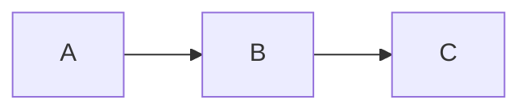

# Markdown en une page

**Markdown** est une façon d'écrire du texte mis en forme à l'aide de
symboles simples. Ce qui est à gauche est ce que vous tapez ; à droite, le
rendu. Dans md-editor, vous n'avez pas besoin de taper ces symboles : vous
les appliquez depuis la barre d'outils et, à l'enregistrement, l'éditeur les
écrit pour vous.

## Sommaire

- [Paragraphes et sauts de ligne](#paragraphes-et-sauts-de-ligne)
- [Titres](#titres)
- [Emphase](#emphase)
- [Listes](#listes)
- [Citations](#citations)
- [Code](#code)
- [Liens et images](#liens-et-images)
- [Notes de bas de page](#notes-de-bas-de-page)
- [Règles horizontales](#regles-horizontales)
- [Tableaux](#tableaux)
- [Formules mathématiques](#formules-mathematiques)
- [Extensions prises en charge par md-editor](#extensions-prises-en-charge-par-md-editor)
- [Front matter](#front-matter)
- [Échappements](#echappements)

## Paragraphes et sauts de ligne

Séparez les paragraphes par une **ligne vide**. À l'intérieur d'un
paragraphe, deux espaces en fin de ligne forcent un saut de ligne sans
ouvrir un nouveau paragraphe.

## Titres

```
# Titre de niveau 1
## Titre de niveau 2
### Titre de niveau 3
```

Jusqu'à six niveaux (`######`). Dans md-editor, vous pouvez aussi les
appliquer depuis **Format → Titre** ou avec Ctrl+1 … Ctrl+6.

## Emphase

- `*italique*` ou `_italique_` → *italique*
- `**gras**` ou `__gras__` → **gras**
- `***gras et italique***` → ***gras et italique***
- `~~barré~~` → ~~barré~~

## Listes

**Puces** (avec `-`, `*` ou `+`) :

```
- Pomme
- Poire
  - Conférence
  - Williams
```

**Numérotées** :

```
1. Premier
2. Deuxième
3. Troisième
```

**Tâches** (cases à cocher) :

```
- [x] Fait
- [ ] À faire
```

## Citations

Une ou plusieurs lignes précédées de `>` :

```
> L'homme qui lit beaucoup et marche beaucoup voit beaucoup et sait beaucoup.
> — Miguel de Cervantes
```

## Code

**En ligne** : entourez d'un accent grave : `` `code` ``.

**Bloc** : trois accents graves au début et à la fin ; éventuellement, le
nom du langage pour le colorer :

````
```python
def saluer(nom):
    print(f"Bonjour, {nom}")
```
````

## Liens et images

- **Lien** : `[texte](https://exemple.com)`
- **Lien avec titre** : `[texte](https://exemple.com "Titre de l'infobulle")`
- **Image** : `` — comme un lien, mais
  avec un `!` devant.

Dans md-editor, **Ctrl+clic** sur un lien l'ouvre dans le navigateur du
système.

## Notes de bas de page

Une **référence** dans le texte et sa **définition** à part, reliées par un
identifiant `[^id]` :

```
Une affirmation avec sa nuance[^1].

[^1]: Le texte de la note va ici.
```

L'`id` peut être un nombre (`[^1]`) ou un mot (`[^nota]`). Dans md-editor,
**Insérer → Note de bas de page** (Ctrl+Shift+N) crée la référence et sa
définition pour vous ; les références s'affichent en exposant et un clic fait
sauter vers la définition.

## Règles horizontales

Trois tirets, astérisques ou tirets bas ou plus, seuls sur une ligne :

```
---
```

## Tableaux

```
| Produit | Quantité | Prix    |
|---------|---------:|:-------:|
| Pain    |        2 |  1,20 € |
| Lait    |        1 |  0,95 € |
```

Les deux-points dans la ligne de séparation fixent l'alignement des
colonnes : `:--` à gauche, `:-:` au centre, `--:` à droite. md-editor
conserve l'alignement à l'enregistrement.

## Formules mathématiques

Le Markdown standard ne définit **pas** les formules, mais une convention
répandue (Pandoc, Obsidian, Quarto, GitHub) prend en charge la syntaxe TeX
entre `$...$` (en ligne) et `$$...$$` (en bloc). md-editor implémente cette
convention.

```
La formule $E = mc^2$ est célèbre.

$$
\sum_{i=1}^n a_i = \frac{n(n+1)}{2}
$$
```

Les caractères spéciaux de TeX (`\`, `_`, `*`, `{`, `}`) restent intacts à
l'intérieur des formules — l'éditeur les protège pour que l'analyseur
Markdown ne les confonde pas avec de l'italique ou du gras.

Dans md-editor, les formules apparaissent rendues avec de vrais exposants et
indices (et non comme `$x^2$` littéral). Insérez-en une avec
**Insertion → Formule…** (Ctrl+Shift+F) ou double-cliquez sur une formule
existante pour la modifier.

## Extensions prises en charge par md-editor

Au-delà de ce qui précède — du Markdown standard —, md-editor comprend quatre
conventions très répandues. Elles ne font pas partie du Markdown d'origine, donc
un autre éditeur peut les afficher comme du texte littéral ; le fichier, lui, est
enregistré tel quel : rien ne se perd.

**Surlignage** (style GitHub/Obsidian) : deux signes égal de chaque côté.

```
Ceci est ==surligné== comme au marqueur.
```

**Exposant et indice** (style Pandoc) : accent circonflexe et tilde.

```
L'aire est de 12 m^2^ et la formule de l'eau est H~2~O.
```

**Admonitions** ou *callouts* (style GitHub) : une citation dont la première
ligne est une étiquette entre crochets. Les étiquettes valides sont `[!NOTE]`,
`[!TIP]`, `[!IMPORTANT]`, `[!WARNING]` et `[!CAUTION]`.

```
> [!WARNING]
> Cette étape efface les données précédentes.
```

**Diagrammes** : un bloc de code avec le langage `mermaid` ou `plantuml`.
L'éditeur en affiche un aperçu sous forme d'image sous le bloc si l'outil
correspondant est installé.

````

````

## Front matter

Beaucoup de générateurs de sites (Jekyll, Hugo, Quarto…) commencent le fichier
par un bloc de métadonnées entre `---` (YAML) ou `+++` (TOML) :

```
---
title: Rapport annuel
lang: fr
---
```

md-editor le conserve **tel quel** à l'enregistrement : il n'est ni modifié ni
affiché dans l'éditeur. C'est de là qu'il tire `title` et `lang` à l'exportation
et pour choisir le dictionnaire du correcteur.

## Échappements

Pour qu'un symbole Markdown apparaisse littéralement (sans agir comme mise en
forme), placez une barre oblique inverse devant lui : `\*pas en italique\*` →
\*pas en italique\*.

Les symboles échappables sont :
```
\ ` * _ { } [ ] ( ) # + - . ! |
```
