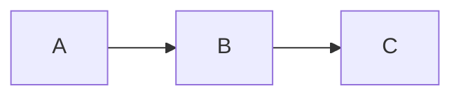

# Markdown op één pagina

**Markdown** is een manier om opgemaakte tekst te schrijven met eenvoudige
symbolen. Wat links staat is wat je typt; rechts staat hoe het eruitziet. In
md-editor hoef je deze symbolen niet te typen: je past ze toe via de werkbalk
en, bij het opslaan, schrijft de editor ze voor je.

## Inhoud

- [Alinea's en regeleinden](#alineas-en-regeleinden)
- [Koppen](#koppen)
- [Nadruk](#nadruk)
- [Lijsten](#lijsten)
- [Citaten](#citaten)
- [Code](#code)
- [Koppelingen en afbeeldingen](#koppelingen-en-afbeeldingen)
- [Voetnoten](#voetnoten)
- [Horizontale lijnen](#horizontale-lijnen)
- [Tabellen](#tabellen)
- [Wiskundige formules](#wiskundige-formules)
- [Uitbreidingen die md-editor ondersteunt](#uitbreidingen-die-md-editor-ondersteunt)
- [Front matter](#front-matter)
- [Escapes](#escapes)

## Alinea's en regeleinden

Scheid alinea's met een **lege regel**. Binnen een alinea forceren twee
spaties aan het einde van een regel een regeleinde zonder een nieuwe alinea te
beginnen.

## Koppen

```
# Kop van niveau 1
## Kop van niveau 2
### Kop van niveau 3
```

Tot zes niveaus (`######`). In md-editor kun je ze ook toepassen via
**Opmaak → Kop** of met Ctrl+1 … Ctrl+6.

## Nadruk

- `*cursief*` of `_cursief_` → *cursief*
- `**vet**` of `__vet__` → **vet**
- `***vet en cursief***` → ***vet en cursief***
- `~~doorhalen~~` → ~~doorhalen~~

## Lijsten

**Opsommingstekens** (met `-`, `*` of `+`):

```
- Appel
- Peer
  - Conference
  - Doyenné
```

**Genummerd**:

```
1. Eerste
2. Tweede
3. Derde
```

**Taken** (selectievakjes):

```
- [x] Klaar
- [ ] Te doen
```

## Citaten

Een of meer regels die beginnen met `>`:

```
> Wie veel leest en veel reist, ziet veel en weet veel.
> — Miguel de Cervantes
```

## Code

**Inline**: omsluit met een backtick: `` `code` ``.

**Blok**: drie backticks aan het begin en het einde; optioneel de naam van de
taal om die te kleuren:

````
```python
def begroet(naam):
    print(f"Hallo, {naam}")
```
````

## Koppelingen en afbeeldingen

- **Koppeling**: `[tekst](https://voorbeeld.nl)`
- **Koppeling met titel**: `[tekst](https://voorbeeld.nl "Tooltip-titel")`
- **Afbeelding**: `` — net als een
  koppeling, maar met een `!` ervoor.

In md-editor opent **Ctrl+klik** op een koppeling die in de systeembrowser.

## Voetnoten

Een **verwijzing** in de tekst en de bijbehorende **definitie** apart,
gekoppeld via een identifier `[^id]`:

```
Een bewering met haar nuance[^1].

[^1]: De tekst van de noot komt hier.
```

De `id` kan een getal (`[^1]`) of een woord (`[^nota]`) zijn. In md-editor
maakt **Invoegen → Voetnoot** (Ctrl+Shift+N) de verwijzing en de definitie voor
je aan; de verwijzingen worden als superscript getoond en een klik springt naar
de definitie.

## Horizontale lijnen

Drie of meer koppeltekens, sterretjes of underscores op een eigen regel:

```
---
```

## Tabellen

```
| Product | Aantal | Prijs   |
|---------|-------:|:-------:|
| Brood   |      2 | € 1,20  |
| Melk    |      1 | € 0,95  |
```

De dubbele punten in de scheidingsregel bepalen de kolomuitlijning: `:--`
links, `:-:` midden, `--:` rechts. md-editor behoudt de uitlijning bij het
opslaan.

## Wiskundige formules

Standaard-Markdown definieert **geen** formules, maar een wijdverspreide
conventie (Pandoc, Obsidian, Quarto, GitHub) ondersteunt TeX-syntaxis tussen
`$...$` (inline) en `$$...$$` (blok). md-editor implementeert deze conventie.

```
De formule $E = mc^2$ is beroemd.

$$
\sum_{i=1}^n a_i = \frac{n(n+1)}{2}
$$
```

Speciale TeX-tekens (`\`, `_`, `*`, `{`, `}`) blijven intact binnen de
formules — de editor beschermt ze zodat de Markdown-parser ze niet verwart met
cursief of vet.

In md-editor verschijnen formules weergegeven met echte super- en subscripts
(niet als letterlijke `$x^2$`). Voeg er een in met **Invoegen → Formule…**
(Ctrl+Shift+F) of dubbelklik op een bestaande om die te bewerken.

## Uitbreidingen die md-editor ondersteunt

Naast het bovenstaande — dat standaard Markdown is — begrijpt md-editor vier
veelgebruikte conventies. Ze horen niet bij het oorspronkelijke Markdown, dus een
andere editor kan ze als letterlijke tekst tonen; het bestand wordt hoe dan ook
onveranderd opgeslagen, er gaat dus niets verloren.

**Markering** (stijl GitHub/Obsidian): twee ist-gelijk-tekens aan elke kant.

```
Dit is ==gemarkeerd== als met een markeerstift.
```

**Superscript en subscript** (Pandoc-stijl): dakje en tilde.

```
De oppervlakte is 12 m^2^ en de formule van water is H~2~O.
```

**Aandachtsblokken** of *callouts* (GitHub-stijl): een citaat waarvan de eerste
regel een label tussen vierkante haken is. Geldig zijn `[!NOTE]`, `[!TIP]`,
`[!IMPORTANT]`, `[!WARNING]` en `[!CAUTION]`.

```
> [!WARNING]
> Deze stap wist de eerdere gegevens.
```

**Diagrammen**: een codeblok met de taal `mermaid` of `plantuml`. De editor toont
er een voorvertoning als afbeelding onder het blok, als je het bijbehorende
programma hebt geïnstalleerd.

````

````

## Front matter

Veel sitegeneratoren (Jekyll, Hugo, Quarto…) beginnen het bestand met een blok
metagegevens tussen `---` (YAML) of `+++` (TOML):

```
---
title: Jaarverslag
lang: nl
---
```

md-editor bewaart het bij het opslaan **onveranderd**: het wordt niet bewerkt en
niet in de editor getoond. Daaruit haalt hij `title` en `lang` bij het exporteren
en om het woordenboek van de spellingcontrole te kiezen.

## Escapes

Om een Markdown-symbool letterlijk te laten verschijnen (zonder als opmaak te
werken), zet je er een backslash voor: `\*niet cursief\*` → \*niet cursief\*.

De escapebare symbolen zijn:
```
\ ` * _ { } [ ] ( ) # + - . ! |
```
