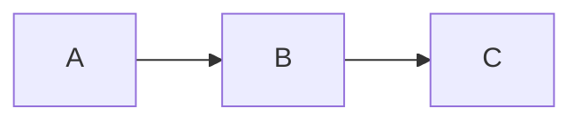

# Markdown numa página

O **Markdown** é uma forma de escrever texto formatado usando símbolos
simples. O que está à esquerda é o que você digita; à direita, como fica. No
md-editor não é preciso digitar estes símbolos: você aplica-os pela barra de
ferramentas e, ao salvar, o editor escreve-os por si.

## Índice

- [Parágrafos e quebras de linha](#paragrafos-e-quebras-de-linha)
- [Cabeçalhos](#cabecalhos)
- [Ênfase](#enfase)
- [Listas](#listas)
- [Citações](#citacoes)
- [Código](#codigo)
- [Links e imagens](#links-e-imagens)
- [Notas de rodapé](#notas-de-rodape)
- [Réguas horizontais](#reguas-horizontais)
- [Tabelas](#tabelas)
- [Fórmulas matemáticas](#formulas-matematicas)
- [Extensões que o md-editor aceita](#extensoes-que-o-md-editor-aceita)
- [Front matter](#front-matter)
- [Escapes](#escapes)

## Parágrafos e quebras de linha

Separe parágrafos com uma **linha em branco**. Dentro de um parágrafo, dois
espaços no fim de uma linha forçam uma quebra de linha sem iniciar um novo
parágrafo.

## Cabeçalhos

```
# Cabeçalho de nível 1
## Cabeçalho de nível 2
### Cabeçalho de nível 3
```

Até seis níveis (`######`). No md-editor também pode aplicá-los a partir de
**Formatar → Cabeçalho** ou com Ctrl+1 … Ctrl+6.

## Ênfase

- `*itálico*` ou `_itálico_` → *itálico*
- `**negrito**` ou `__negrito__` → **negrito**
- `***negrito e itálico***` → ***negrito e itálico***
- `~~tachado~~` → ~~tachado~~

## Listas

**Marcadores** (com `-`, `*` ou `+`):

```
- Maçã
- Pera
  - Rocha
  - Passe-Crassane
```

**Numeradas**:

```
1. Primeiro
2. Segundo
3. Terceiro
```

**Tarefas** (caixas de seleção):

```
- [x] Feito
- [ ] Pendente
```

## Citações

Uma ou mais linhas precedidas por `>`:

```
> Quem muito lê e muito anda, muito vê e muito sabe.
> — Miguel de Cervantes
```

## Código

**Em linha**: rodeie com um acento grave: `` `código` ``.

**Bloco**: três acentos graves no início e no fim; opcionalmente, o nome do
linguagem para colori-lo:

````
```python
def saudar(nome):
    print(f"Olá, {nome}")
```
````

## Links e imagens

- **Link**: `[texto](https://exemplo.com)`
- **Link com título**: `[texto](https://exemplo.com "Título da dica")`
- **Imagem**: `` — igual ao link, mas
  com um `!` à frente.

No md-editor, **Ctrl+clique** sobre um link abre-o no navegador do sistema.

## Notas de rodapé

Uma **referência** no texto e a sua **definição** à parte, ligadas por um
identificador `[^id]`:

```
Uma afirmação com a sua nuance[^1].

[^1]: O texto da nota vai aqui.
```

O `id` pode ser um número (`[^1]`) ou uma palavra (`[^nota]`). No md-editor,
**Inserir → Nota de rodapé** (Ctrl+Shift+N) cria a referência e a sua definição
por si; as referências aparecem como sobrescrito e um clique salta para a
definição.

## Réguas horizontais

Três ou mais hifens, asteriscos ou sublinhados numa linha só deles:

```
---
```

## Tabelas

```
| Produto | Quantidade | Preço  |
|---------|-----------:|:------:|
| Pão     |          2 | 1,20 € |
| Leite   |          1 | 0,95 € |
```

Os dois pontos na linha de separação definem o alinhamento da coluna: `:--`
à esquerda, `:-:` ao centro, `--:` à direita. O md-editor preserva o
alinhamento ao salvar.

## Fórmulas matemáticas

O Markdown padrão **não** define fórmulas, mas há uma convenção muito difundida
(Pandoc, Obsidian, Quarto, GitHub) que admite a sintaxe de TeX entre `$...$`
(em linha) e `$$...$$` (em bloco). O md-editor implementa esta convenção.

```
A fórmula $E = mc^2$ é famosa.

$$
\sum_{i=1}^n a_i = \frac{n(n+1)}{2}
$$
```

Os caracteres especiais de TeX (`\`, `_`, `*`, `{`, `}`) são mantidos intactos
dentro das fórmulas — o editor protege-os para que o analisador de Markdown não
os confunda com itálico ou negrito.

No md-editor as fórmulas aparecem renderizadas com sobrescritos e subscritos
reais (não como `$x^2$` literal). Insira uma com **Inserir → Fórmula…**
(Ctrl+Shift+F) ou faça duplo clique sobre uma existente para editá-la.

## Extensões que o md-editor aceita

Além do anterior — que é Markdown padrão —, o md-editor entende quatro
convenções muito difundidas. Elas não fazem parte do Markdown original, então
outro editor pode mostrá-las como texto literal; o arquivo, de todo modo, é salvo
tal como está e nada se perde.

**Realce** (estilo GitHub/Obsidian): dois sinais de igual de cada lado.

```
Isto fica ==realçado== como com um marca-texto.
```

**Sobrescrito e subscrito** (estilo Pandoc): acento circunflexo e til.

```
A área é 12 m^2^ e a fórmula da água é H~2~O.
```

**Admoestações** ou *callouts* (estilo GitHub): uma citação cuja primeira linha é
um rótulo entre colchetes. Valem `[!NOTE]`, `[!TIP]`, `[!IMPORTANT]`,
`[!WARNING]` e `[!CAUTION]`.

```
> [!WARNING]
> Esta etapa apaga os dados anteriores.
```

**Diagramas**: um bloco de código com a linguagem `mermaid` ou `plantuml`. O
editor mostra uma pré-visualização como imagem abaixo do bloco se você tiver a
ferramenta correspondente instalada.

````

````

## Front matter

Muitos geradores de sites (Jekyll, Hugo, Quarto…) começam o arquivo com um bloco
de metadados entre `---` (YAML) ou `+++` (TOML):

```
---
title: Relatório anual
lang: pt
---
```

O md-editor o conserva **tal como está** ao salvar: não é editado nem aparece no
editor. É de lá que ele tira o `title` e o `lang` ao exportar e para escolher o
dicionário do corretor ortográfico.

## Escapes

Para que um símbolo de Markdown apareça literal (sem atuar como formatação),
ponha uma barra invertida à frente dele: `\*não é itálico\*` → \*não é itálico\*.

Os símbolos que se podem escapar são:
```
\ ` * _ { } [ ] ( ) # + - . ! |
```
